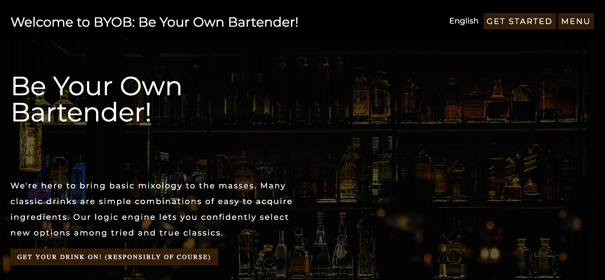

# Team_Awesome_Group_Project

# B.Y.O.B -- Be Your Own Bartender

## Contents:
- Team Members
- Project Description
- Project Design
- Tech/APIs/Library in Use

## Team Members
- Morgan  - GitHub Master
- Caitlyn
- Tamar
- Deedee
- Meron

## Project Description:
The B.Y.O.B - Be Your Own Bartender project provides a one-stop platform, allowing users to search and browse the many alcoholic recipes. We are here to bring basic mixology to the masses.  Tasty classics with ingredients you should be able to aquire easily. We will tell you what you need and how much of it to use.
Why B.Y.O.B? Because being your own bartender is just fun.

## Project Design
This is a Single Page Web Application that is dynamically inserting the content (views) on a single page

## Tech/APIs/Library in Use
- HTML, CSS, Bootstrap, Javascript, jQuery, Ajax 
- The Cocktail DB 
- Age Verify
- Flicker
- CSS uses Flexbox, Bootstrap CSS, and CSS only animation
